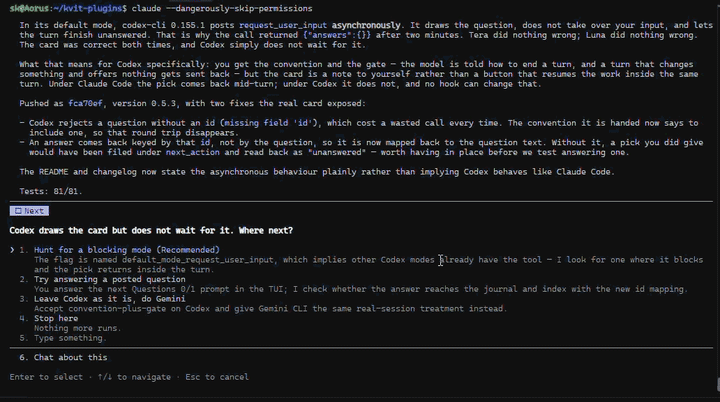

# What's Next

A Claude Code plugin. It changes how a turn ends: instead of a long end of turn report
it finishes with a short report and a question/suggestion you respond to by selecting one
of two to four options.



*By [kvit](https://kvit.app). Free and MIT licensed — read [why a turn should end with a choice](https://blog.kvit.app/posts/ending-a-turn-with-a-choice/).*

## The problem it addresses

When Claude finishes a piece of work, the thing you have to act on — do this
next, or answer that, or it stopped because of this — sits inside prose. You
read the paragraph, then type "what's next" or "continue", and pay for another
round trip to get back to where the work was already pointing.

Claude Code already has the right widget for this: the `AskUserQuestion` tool
draws a card of labelled options, keyboard-selectable, with free text always
available. This plugin makes that call the way a working turn
ends, and checks that it happened.

## Install

```
/plugin marketplace add https://github.com/kvitapp/kvit-plugins.git
/plugin install whats-next@kvit
```

That is all. The next session starts with the convention in force, and removing
the plugin removes it.

## Updating

Installing copies the plugin's files into
`~/.claude/plugins/cache/<marketplace>/whats-next/<version>/`, and that
copy stays at the commit it was taken from until it is updated. On a machine
where the plugin is already installed, two commands bring it up to date:

```
claude plugin marketplace update kvit
claude plugin update whats-next@kvit
```

## What a turn looks like afterwards

> Reordering works and survives a restart.
> - Moved the reorder logic into `internal/order`, hidden rows keep their slots.
> - Tests: `go test ./internal/order` — 14/14 pass.

followed by a card:

```
  Reordering works, 14/14 tests pass. How to proceed?          [Next]
  -> Commit (Recommended)   Commit the reorder implementation now.
     Changelog too          Add the changelog entry, then commit.
     Stop here              Leave it uncommitted; nothing more runs.
```

Picking an option resumes the session.

## Switches

| Variable | Effect |
|---|---|
| `REPORT_GATE=off` | The convention is not sent and the Stop hook does nothing. |
| `REPORT_CARD_DISPLAY=off` | No screen markers. |
| `REPORT_GATE_MAX_BLOCKS` | How many times one prompt may be blocked before the hook gives up. Default 2. |
| `REPORT_GATE_MUTATING_TOOLS` | Extra tool names to count as work done, space or comma separated. |

Each of these can be set in the environment, in an `env` block in a project's
`.claude/settings.json`, or in `~/.whats-next/config.json` for a machine-wide
answer that does not belong to any one agent:

```json
{ "REPORT_GATE": "off" }
```

## Licence

MIT. See [LICENSE](LICENSE).
